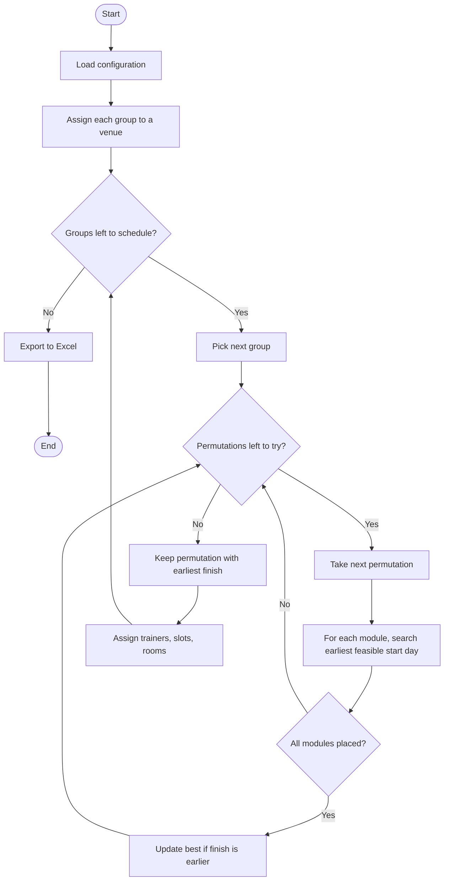
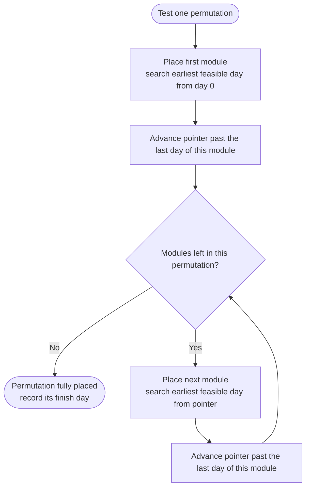
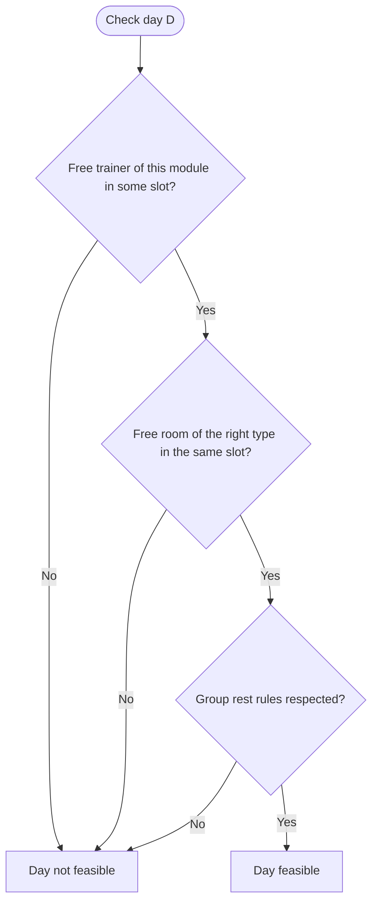
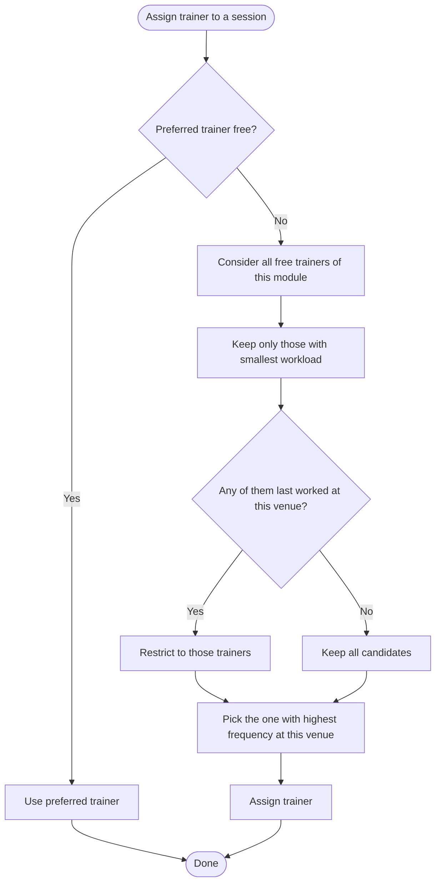

# Training Scheduler
A Python tool that schedules – potentially – complex training for any number of groups of trainees across multiple geographic venues, respecting rooms, trainers, rest days, and trainer travel constraints.

It was born from a real need: coordinating training for hundreds of groups across several venues, each venue with its own practice and theory rooms, and each trainer being an expert in only one module.

# Table of contents
1. [Vibe coding warning](#vibe-coding-warning)
2. [What this tool does](#what-this-tool-does)
3. [Requirements](#requirements)
4. [Quick start](#quick-start)
5. [Understanding the output](#understanding-the-output)
6. [How the scheduler works](#how-the-scheduler-works)
7. [Customising the scheduler — the `Config` class](#customising-the-scheduler--the-config-class)
8. [Using the script without theory / practice distinction](#using-the-script-without-theory--practice-distinction)
9. [Running from the command line](#running-from-the-command-line)
10. [Technical section (for developers)](#technical-section-for-developers)
    - [More detailed algorithm explanation](#more-detailed-algorithm-explanation)
    - [Data structures](#data-structures)
    - [Known issues and limitations](#known-issues-and-limitations)
    - [Possible additional features](#possible-additional-features)

# Vibe coding warning
This code has been created mainly with AI (DeepSeek) because I'm not able to code. It has been tested manually, randomly checking some days by filtering the Excel table.

# What this tool does
Imagine you need to organise the same training programme for many groups of people. The programme is composed of modules, each module may have a certain number of theory sessions and practice sessions. Every group must go through all the modules, in some order, and may need to respect a rest period between two consecutive training days (because they need to digest what they learned or because they may have other commitments). The order of the modules is free: a group can, for example, do Module 5 first, then Module 1, then Module 3. The only rule is that a module must be completed once it has started — sessions of two different modules cannot interleave for the same group.

The groups are spread across different geographic areas (venues). Each venue contains a fixed number of rooms, some may be dedicated to theory and some to practice. Because of geographical constraints, every group is bound to one venue: its participants can only train in the rooms of the venue they belong to.

Trainers are not shared between modules: the trainers of Module 1 only teach Module 1, the trainers of Module 2 only Module 2, and so on. Trainers are also a scarce resource — each module has only a fixed number of them, and each trainer can deliver at most a fixed number of sessions per day (slots per day).

The scheduler produces an Excel calendar telling you, for every group and every day, which module, which activity, which trainer, which venue and which room are involved.

It also produces a detailed table with the same information in separate columns, easier to filter and analyse as a table

# Requirements
Does this tool fit your training? Before using the scheduler, check that your training programme has the
characteristics below. If one of them does not apply to your situation, this tool is not suitable for you.

## Programme structure

- **A fixed set of modules, identical for every group.** All groups follow the same programme: the same modules, the same number of sessions per module.
- **No prerequisite order between modules.** Any module can be taken at any time. A group can do Module 5 first and Module 1 last. The script will choose the order that fits each group's calendar best.
- **Modules cannot interleave.** Once a group starts a module, it must finish all of that module's sessions before starting the next one. The script enforces this by treating each module as an indivisible block.
- **Any number of modules, configurable in the code**. ⚠️ Note: the current algorithm scales factorially with the number of modules. It basically means that it can work fine and fast up to about 6 modules. With 7 or more, runtime grows quickly and the code can become very slow.

## Venues and rooms

- **Every group belongs to exactly one venue for the entire programme.** A group cannot switch venues mid‑way. Venues are geographic areas, and the group's participants are assumed to be able to reach only their own.
- **Each venue has a fixed number of theory rooms and practice rooms.** Rooms within the same venue and of the same type are interchangeable: the script cares about how many there are, not which specific one is used.
- **Rooms have no other properties.** No capacity, no equipment, no specialisation beyond "theory" or "practice". If some rooms are larger or better equipped and you need to match specific groups to them, this tool cannot do that.

## Trainers

- **Each trainer teaches exactly one module.** Trainers are not interchangeable across modules: a Module 2 trainer cannot teach Module 4, even temporarily.
- **Each module has its own pool of trainers, with a fixed size.** The number of trainers per module is a configuration parameter and can differ from module to module.
- **Trainers have no availability constraints beyond the slot model.** No vacations, no part‑time days, no "only available in the morning". A trainer is either free or busy on a given slot, nothing else.
- **Trainers have no geographical constraints**. Contrary to the groups, trainers don't pertain to any specific venue or groups of venues. The code assumes that they are free to travel to every venue, but still tries to keep the movement as low as possible.

## Time and sessions

- **All sessions have the same duration.** Every session occupies exactly one slot, and every slot is equivalent. You can input in the script how many sessions there are per day. Every day will always have the same set of sessions.
- **Rest days are uniform across the programme.** The same number of rest days applies between every pair of consecutive training days, for every group and every module. The value is configurable but not per‑module.
- **No deadlines.** The scheduler minimises the total calendar length, but you cannot ask it to "finish Module 3 by a certain date". It will place sessions as early as resources allow, not according to external targets.
- **Groups are independent.** Groups do not have to coordinate with each other. Their only interaction is through shared trainers and shared rooms within a venue.

## What this tool is *not* designed for

- Programmes where modules must be taken in a specific sequence.
- Programmes where a group can be split across venues.
- Programmes where the same trainer teaches multiple modules.
- Programmes with per‑module rest days or per‑session durations.
- Programmes with rooms that have specific requirements (capacity,
  equipment) beyond the theory/practice split.
# Quick start
1. Install Python 3.10 or newer.
2. Install the required libraries:
```
pip install pandas openpyxl
```
3. Open the file in any text editor, scroll to the `Config` class, adjust the parameters (see below).
4. Run:
```
python "training-scheduler.py"
```
5. Find the Excel file at the path indicated in the `Config` class.

# Understanding the output
The Excel file has two sheets.

## Calendar
A grid where rows are groups and columns are days. Days are split into slots, so a column labelled `Day 3-2` means "day 3, slot 2". Each (day, slot) pair gets its own column in the Calendar. If a group has more than one session on the same day (possible when `max_trainings_per_day_per_group >= 2`), those sessions appear in different columns, one per slot.

In each cell you'll find a string in this format:
```
module-activity-trainer-venue-room
```
For example, `2-T-13-4-1` means: Module 2, Theory, trainer number 13, venue 4, room 1.

## Detailed
A flat table with one row per session and these columns: `Day`, `Slot`, `Group`, `Module`, `Activity`, `Trainer`, `Venue`, `Room`.

This is the sheet you want to use if you need to filter, sort, or merge with other data.

## How the scheduler works

[Flowchart of the script](#flowchart-of-the-script)

**Step 1 — Groups are attached to venues.** Each group belongs to exactly one venue, because participants can only train in the rooms of their own area. Either the script distributes groups evenly across venues, or you tell it exactly how many groups belong to each.

**Step 2 — For each group, the script tries every possible order of the modules.** For example, in the current configuration, there are 5 modules, so there are 5 × 4 × 3 × 2 × 1 = 120 possible orders. For each order, the script attempts to fit the modules as early as possible in the calendar. Each module is treated as an indivisible block: the script places all sessions of the first module of the permutation, then all sessions of the second, and so on. It never interleaves sessions of two different modules for the same group. This is what guarantees that, once a module has begun, it is completed before the next one starts. When it has tested all 120 orders, it keeps the one that finishes soonest. Then it moves on to the next group.
[Flowchart of Step 2](#flowchart-of-permutation)

**Step 3 — Fitting a module into the calendar.** For a given module in a given order, the script looks for the earliest day the group can start it. To accept a day, it checks three things:

- **Trainer availability**: is there a free trainer for that module, in any slot of that day?
- **Room availability**: is there a free room of the right kind (theory or practice) in the group's venue, in the same slot?
- **Group rules**: does the group respect its own constraints? (Enough rest days since the previous session? Already busy that day?)

If all three checks pass, the session is placed. If any fails, the script tries the next day, and so on, until it finds a suitable one. This is why a session may end up a few days later than strictly necessary if the trainers or rooms are already busy.

[Flowchart of Step 3](#flowchart-of-the-feasibility-check-for-a-single-day)

**Step 4 — Assigning trainers.** Once all the calendar days are fixed, the script picks a trainer for every session. It follows this priority order:

1. **Continuity.** If the group already had a session of the same module with a certain trainer, the script tries to keep that same trainer. This gives the group consistency of teaching throughout a module.
2. **Workload balance.** Among the free trainers of that module, the script prefers the ones who have worked less, so the burden is shared fairly.
3. **Venue consistency.** Among those, the script tries to reduce travel. It first checks whether any of them last worked at this same venue — those trainers are most likely already there and won't need to move. If there are several such trainers, the script picks the one who has worked at this venue the most often in the past. If none of the tied trainers was last at this venue, the script skips that first check and simply picks the one with the most past assignments to this venue.
4. **Smallest ID.** If there are still ties, the trainer with the smallest number is chosen, for reproducibility.

[Flowchart of Step 4](#flowchart-of-trainer-assignment-priority)

**A note on continuity.** The continuity preference is **best‑effort**: it only works if the same trainer happens to be free on the days the group needs. If not, a different trainer is assigned and the preference is dropped. The script does **not** delay a session just to keep the same trainer, because that would lengthen the calendar. Continuity is nice to have, not a hard rule.

**A note on optimality.** The script is **locally optimal**, not **globally optimal**. It chooses the best option for each group *one at a time*, without never coming back to previous allocations, but the final result may not be the absolute mathematical best. Think of it as packing a suitcase: you take items one by one and place them where they fit best at that moment, without ever rearranging everything to find the perfect packing. In our case, "packing one item" = "scheduling one group". For example, when the code schedules group 5, it picks the choice that looks best for group 5 at that moment. But that choice might make things harder for group 200 later on.

To produce the mathematically best calendar, the script would have to compare every possible combination of orderings, days, trainers and rooms for all groups simultaneously — an astronomically large number. Imagine a modest scenario: 10 venues, each serving 10 groups, 5 modules with 20 sessions. The total number of possible calendars would be on the order of 10²³⁰⁰. For comparison: the number of atoms in the observable universe is about 10⁸⁰. So the calendar you get is valid and reasonably compact, but it is not provably the theoretical minimum.

⚠️ Note: these calculations have been made by the AI.

# Customising the scheduler — the Config class
Everything you can tweak lives inside the `Config` class, right at the top of the script. Below is a description of every parameter.

## `num_groups`
How many groups you need to schedule. Example: `self.num_groups = 172`.

## `trainers_per_module`
A list, one number per module, in module order (module 1, module 2, …). The length must equal the number of modules defined in `BLOCKS`. Example: `self.trainers_per_module = [7, 5, 7, 7, 7]` means 7 trainers for Module 1, 5 for Module 2, 7 for Module 3, and so on.

Trainers are not interchangeable: a trainer of Module 2 cannot teach Module 4. Each module's trainers are a separate pool.

## `rest_days`
Number of rest days between two consecutive training days for the same group. Example: `self.rest_days = 1` means that if a group trains on day 10, the next training day can be day 12 at the earliest. If a group has more than one session on the same day, the day counts as one training day.

⚠️ Note: if you want training days back‑to‑back, set this to 0.

## `slots_per_day`
How many training sessions a single trainer (or a single room) can host in one day. Example: `self.slots_per_day = 2` means morning + afternoon, `self.slots_per_day = 3` means morning + afternoon + evening. This value also caps `max_trainings_per_day_per_group` (see below).

## `max_trainings_per_day_per_group`
Maximum number of sessions that the same group can attend in one day. For example:

- `self.max_trainings_per_day_per_group = 1` means each group attends at most one session per day, even if more slots are available.
- `self.max_trainings_per_day_per_group = 2` (with `slots_per_day >= 2`) means each group can attend both morning and afternoon, packing two sessions into the same day instead of spreading them over two days.

This parameter must satisfy `1 <= max_trainings_per_day_per_group <= slots_per_day`. If you set it higher than `slots_per_day`, the script raises an error, because a group cannot physically attend more sessions than there are slots in a day.

⚠️ Note: increasing this value does not shorten the rest days. Rest days are counted between training days, not between individual sessions. If rest_days = 6 and a group has 2 sessions on day 10, the next training day (whether one session or two) is still day 17 at the earliest.

## `practice_rooms_per_venue`
A list, one element per venue, telling how many practice rooms each venue has. Example: `self.practice_rooms_per_venue = [4, 2, 4, 1, 1, 2, 3, 2, 5, 2, 4, 6]`.

## `theory_rooms_per_venue`
Same as above but for theory rooms. Must have the same length as `practice_rooms_per_venue`.

## `groups_per_venue`
How many groups are attached to each venue. Two options:
- `self.groups_per_venue = None` — the code distributes groups as evenly as possible across venues.
- A list — for example `self.groups_per_venue = [10, 12, 15, 8, 14, 13, 11, 16, 9, 17, 20, 27]`. The sum must equal `num_groups`, and the length must equal the number of venues. This is what you want to use if you already know how many participants come from each area.

## `max_workload_diff`
A warning threshold. At the end of the run, the script checks whether, within each module, the busiest trainer worked significantly more days than the least busy one. If the difference exceeds this number, a warning is printed.

⚠️ Note: This does not affect scheduling: the script will never refuse to schedule or delay a group to satisfy this threshold. It's just a signal that the group distribution across venues might be too unbalanced for the trainers to stay even. Raise it if you want fewer warnings, lower it if you want to be strict.

## `output_path`
Full path of the Excel file to produce. Example: `self.output_path = "C:/Users/yourname/Desktop/schedule.xlsx"`.

## Editing the `BLOCKS` dictionary
Below the Config class there is a section called `BLOCKS`. It describes, for each module, the ordered list of sessions it contains, in this format:
```
'M1': [(1, 'T'), (1, 'T'), (1, 'T'), (1, 'P'), (1, 'P'), (1, 'P')]
```
Each `(number, letter)` pair means "one session of module *number*, activity *letter*", where `T` = Theory and `P` = Practice. The list is ordered: the first element is the first session the group will take, the second element the second, and so on.

To change how many sessions a module has, or the sequence of theory/practice, just edit these lists.

To add a module, do two things:
1. add an entry to `BLOCKS`, for example `'M6': [(6, 'T'), (6, 'T'), (6, 'P')]`;
2. add the corresponding number of trainers to `trainers_per_module`. Nothing else. Removing a module follows the same logic in reverse.

⚠️ Note: Module numbers must stay consecutive starting from 1.

## Using the script without theory / practice distinction
If your training program have no theory/practice split (it only has just "training sessions"), the script works still fine, without any modification to the code. Be sure to follow these two steps:

1. In the `BLOCKS` dictionary, only use `T`. The list now only contains `(module, 'T')` pairs.
2. In the Config, put all your rooms in `theory_rooms_per_venue`, and set `practice_rooms_per_venue` to a list of zeros of the same length. For example, if you have 12 venues with 6, 6, 6, 2, 2, 3, 5, 5, 10, 4, 6 and 13 rooms respectively:
```
self.practice_rooms_per_venue = [0, 0, 0, 0, 0, 0, 0, 0, 0, 0, 0, 0]
self.theory_rooms_per_venue  = [6, 6, 6, 2, 2, 3, 5, 5, 10, 4, 6, 13]
```
Every session will be scheduled as "theory", using the theory room pool. The practice rooms are never requested, so their values don't matter — zeros are fine.

The output will still show `T` in the calendar and `T` in the Activity column. You can simply read `T` as "training" in your head.

# Running from the command line
⚠️ Note: this feature is actually not tested because I don't like to run from the command line

If you prefer, you can pass parameters on the command line without touching the file. Every Config parameter has a matching flag:
```
python "training-scheduler.py" \
    --groups 200 \
    --rest 5 \
    --slots 2 \
    --trainers 8 6 8 8 8 \
    --practice-rooms "4,2,4,1,1,2,3,2,5,2,4,6" \
    --theory-rooms "2,4,2,1,1,1,2,3,5,2,2,7" \
    --groups-per-venue "15,15,15,15,15,15,15,15,15,15,15,20" \
    --output "my_schedule.xlsx" \
    --max-workload-diff 5
```
Any flag you don't pass uses the corresponding value from `Config`.

⚠️ Note: the `BLOCKS` dictionary cannot currently be set from the command line — if you need to change the number or the order of sessions per module, edit the file directly.

# Technical section (for developers)
## More detailed algorithm explanation
The algorithm is a greedy, group‑by‑group scheduler with a local permutation search.

1. __Group assignment to venues__. Each group is assigned to exactly one venue. If `groups_per_venue` is `None`, distribution is round‑robin (equal as possible); otherwise the user‑provided list is used.
2. __Per‑group scheduling__. Groups are processed sequentially, from group 0 upwards. The order matters: earlier groups get "first pick" on the resource pool, later groups are fitted around them.
3. __Permutation search over block order__. For each group, the scheduler enumerates all `5! = 120` orderings of the five module blocks (according to the configuration you already find in the code, which is customizable). For each ordering, it tries to place each block as early as possible using a greedy earliest‑start search (`find_earliest_start`). The ordering that minimises the finish day of that group is chosen. Note that this is a local optimisation, not a global one.
4. __Feasibility check (`can_place_block`)__. Before a block is placed on a candidate start day, three things are verified for every session of the block:
   - Trainer availability in the specific module's pool, for that day and that slot.
   - Room availability in the group's venue, for that day and that slot.
   - Group constraints: rest days since the previous session, and maximum number of trainings per day.

The candidate start day is advanced by one calendar day until all three pass.

5. __Trainer assignment (`assign_session`)__, applied after the days are fixed, so it can never alter the makespan. The preference order is:

  - Continuity — the same trainer who already taught this module to this group.
  - Minimal workload — among free trainers of that module, those with the fewest days worked.
  - Venue consistency — among those, whoever was last assigned to the same venue, then whoever has worked most at that venue (reduces travel).
  - Smallest id — deterministic fallback.

6. __Slot and room selection__. For each session, slots are tried from `0` to `slots_per_day-1` (earliest first). For a given slot, the smallest available room is picked.

### Flowchart of the script
⚠️ Note: this graph has been made by the AI

### Flowchart of permutation
⚠️ Note: this graph has been made by the AI

### Flowchart of the feasibility check for a single day
⚠️ Note: this graph has been made by the AI

### Flowchart of trainer assignment priority
⚠️ Note: this graph has been made by the AI

## Data structures
All state lives in `ScheduleState`:

- `venue_for_group: list[int]` — venue assigned to each group.
- `trainer_busy[module][day][slot]: set[int]` — local ids of busy trainers in each module, day and slot.
- `trainer_total_days[module]: list[int]` — cumulative days worked by each trainer of the module.
- `practice_room_usage[venue][day][slot]: set[int]` and `theory_room_usage[venue][day][slot]: set[int]` — occupied room indices.
- `trainer_last_venue[module][trainer]` and `trainer_venue_freq[module][trainer][venue]` — used by the venue consistency heuristic.
- `group_last_day[group]` and `group_busy_days[group]` — enforce group‑level constraints.
- `assignments: list[dict]` — the final schedule; one dict per session, with day, slot, group, module, activity, trainer, venue, room.

## Known issues and limitations
- Not globally optimal. The scheduler is greedy and processes groups in order. The final makespan can therefore be longer than the true optimum. In particular:
  - The permutation chosen for group *i* is the best for group *i* alone, given the current state. It may be a bad choice for group *i+1*, *i+2*, etc.
  - Groups with smaller ids get first pick on all resources. If `groups_per_venue` is set to a highly unbalanced distribution, later groups may be forced to start much later.
- No backtracking between groups. If a late group cannot be scheduled within a reasonable horizon (2000 days forward from its lower bound), `find_earliest_start` returns `None`, no feasible permutation is found, and the script stops with a `RuntimeError` naming the group that failed. In practice this never happens with realistic inputs, but it's not handled gracefully.
- Fixed block sequence within a module. The `BLOCKS` dictionary determines the exact order of sessions inside a module. Once fixed, the scheduler cannot reorder them (for example, to move a theory session after a practice session to fit a specific gap).
- The 2000‑day search limit in `find_earliest_start` is hard‑coded. If you set up an extraordinarily sparse capacity scenario, the search could return `None` without a clear explanation.
- Excel columns are dense. With many groups and many days, the Calendar sheet can become extremely wide.
- I've never asked the AI ​​to refactor the code, because I honestly don't care, I wouldn't be able to fully understand it anyway. Moreover, the code is already fast.
- The code is fast and reliable up to 6 modules. With 7 or more, runtime can grow quickly because the possible combinations of modules grows exponentially.

## Possible additional features
⚠️ Note: Some of this features have been suggested by the AI.

These are features that would make the tool more powerful, for whoever would like to implement them in the original code.
- __Graphical user interface__. A simple desktop or web app where users can set Config parameters via forms, click "run", and preview the calendar without touching Python.
- __Rescheduling of one session__. Allow the user to mark a specific session as impossible on a given day, and let the scheduler move it to the next feasible day (with a loose and a strict mode).
- __Configurable activity types__. Currently only `T` and `P` exist. Let the user rename them, add more (e.g. `E` for exam, `W` for workshop, etc.) and define per‑type room pools.
- __Improved optimisation__. Replace the greedy scheduler with:
  - A Constraint Programming (CP) or Integer Linear Programming (ILP) model using Google OR‑Tools or similar.
  - Or a local search / simulated annealing optimiser that starts from the current schedule and improves it.
- __Read input from Excel/CSV__. Let the user list groups, venues and rooms in a spreadsheet instead of editing Python lists.
- __Multi‑skill trainers__. Allow a trainer to teach more than one module, with optional efficiency penalties.
- __Trainer availability windows__. Mark some trainers as unavailable on specific dates (holidays, contract limits, etc.).
- __Export to `.ics` / Google Calendar__, so participants can subscribe to their own group's schedule.
- __Conflict detection report__. A post‑processing step that scans the Excel output and reports any violations (this would serve both as a sanity check and as a regression test).
- __Undo / redo of manual edits__. If a GUI is built, a versioned history of the schedule would be invaluable.
- __Parallel / distributed scheduling__. For very large instances, split groups across workers and merge.
- __Better logging__. Currently the script prints a progress line every 20 groups. A proper log file with timestamps and per‑group decisions would help debugging.
- __Unit tests__. A small test suite validating the invariants (no double‑booked trainer, no double‑booked room, rest days respected, etc.) would make contributions safer.
- __Hierarchy customization__: Possibility to activate or disable or reorder decision criteria like: Does each group have to go through the modules in order? Can modules interleave? Is the trainer continuity mandatory?
- __Live preview__: Possibility to have a live preview of the calendar before exporting it to Excel, or possibility to have a preview of some useful data (e.g. total number of days) before exporting to Excel.
- __Different algorithms__: for 7 or more modules, the script can become very slow. It should change algorithm.

## Contributing
Pull requests and issues are welcome. If you're proposing an algorithmic improvement, please include a short description of the scenario you are targeting.
